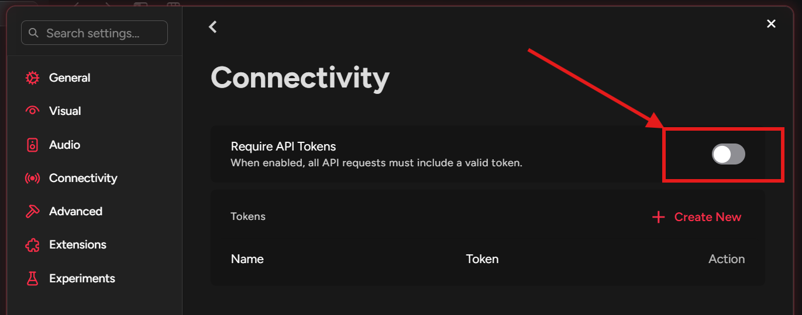

# OmniLyrics

OmniLyrics: A personal attempt to build the lyric tool I always wanted -- CLI, TUI, GUI, and cross-platform.

## Showcase

Windows Terminal (Default Mode):


macOS Terminal (Default Mode):


Linux Waybar (Line Mode, --mode line):


## Build Instruction
Download and Install [.NET SDK 8.0](https://dotnet.microsoft.com/en-us/download/dotnet/8.0)

Clone:
```bash
git clone https://github.com/zzxzzk115/OmniLyrics.git
```

Build and Run:
```bash
cd OmniLyrics

# Build the entire solution
dotnet build

# Launch the Windows CLI
dotnet run --project src/OmniLyrics.Cli.Windows

# Launch the Non-Windows CLI
dotnet run --project src/OmniLyrics.Cli

# Non-Windows CLI in single-line output mode
# (Suitable for status bars)
dotnet run --project src/OmniLyrics.Cli --mode line

# -------------------------------------------------------------------
# Remote control commands
# These commands require an Omnilyrics instance running in lyrics/daemon mode.
# -------------------------------------------------------------------

# Playback control
dotnet run --project src/OmniLyrics.Cli --control play
dotnet run --project src/OmniLyrics.Cli --control pause
dotnet run --project src/OmniLyrics.Cli --control toggle

# Track navigation
dotnet run --project src/OmniLyrics.Cli --control prev
dotnet run --project src/OmniLyrics.Cli --control next

# Seek to a position (in seconds)
dotnet run --project src/OmniLyrics.Cli --control seek 10
```

### Waybar Module Config

```
// OmniLyrics
"custom/OmniLyrics": {
  "format": "  {text}",
  "exec": "/path/to/OmniLyrics.Cli --mode line",
  "return-type": "text",
  "escape": true
},
```

## Cider V3 Settings

Settings -> Connectivity -> Manage External Application Access to Cider -> Disable "Require API Tokens"



> Currently, we don't have custom token support.

## TODO List
Common Backends:
- [x] SMTC for Windows
- [x] MPRIS for Linux
- [x] media-control for macOS

Software-specific Backends:
- [x] [Cider v3](https://cider.sh/) (Current Commercial Version)
- [ ] [Cider v2](https://v2.cider.sh/) (Previous Commercial Version)
- [ ] [Cider v1](https://github.com/ciderapp/Cider) (Open Source Version)
- [x] [YesPlayMusic](https://github.com/qier222/YesPlayMusic)

CLI:
- [x] Multiple Line Mode (Default)
- [x] Single Line Mode (for Waybar)

TUI:

GUI:

## Acknowledgement
- [Lyricify-Lyrics-Helper](https://github.com/WXRIW/Lyricify-Lyrics-Helper)
- [WindowsMediaController](https://github.com/DubyaDude/WindowsMediaController)
- [Tmds.DBus](https://github.com/tmds/Tmds.DBus)
- [media-control](https://github.com/ungive/media-control)

## License

This project is under the [MIT](./LICENSE) License.